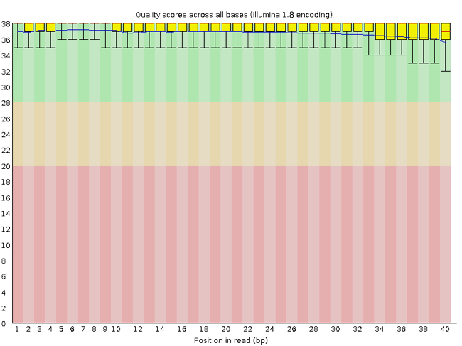

# Setup

When working with high-throughput sequencing data, the raw reads you get off of the sequencer will need to pass
through a number of  different tools in order to generate your final desired output. The execution of this set of
tools in a specified order is commonly referred to as a *workflow* or a *pipeline*.

An example of a typical mRNA-Seq workflow is provided below:

1. Quality control - Assessing quality using FastQC
2. Quality control - Trimming and/or filtering reads (if necessary)
3. Align reads to reference genome
4. Perform post-alignment clean-up
5. Create counts table

These workflows in bioinformatics adopt a plug-and-play approach in that the output of one tool can be easily
used as input to another tool without any extensive configuration. Having standards for data formats is what
makes this feasible. Standards ensure that data is stored in a way that is generally accepted and agreed upon
within the community. The tools that are used to analyze data at different stages of the workflow are therefore
built under the assumption that the data will be provided in a specific format.  

# Starting with Data

## Description
Often times, the first step in a bioinformatics workflow is getting the data you want to work with onto a computer where you can work with it. If you have sequenced your own data, the sequencing center will usually provide you with a link that you can use to download your data. Today we will be working with a dataset made available by Max van Hooren.

We are studying a drought experiment containing 6 arabidopsis shoot samples. All grown 12 days on agar, 9 days on vermiculite with media. Then the drought group (21, 23, 24) got their media taken away, while the control group (06, 07, 08) kept their media for another 6 days after which the samples were harvested.

From these samples, mRNA were sequenced using the Proton Ion system ([RNA Biology & Applied Bioinformatics group@SILS](http://sils.uva.nl/content/research-groups/rna-biology--applied-bioinformatics/rna-biology--applied-bioinformatics.html)). 6 raw sequence files were randomly subsampled to contain 1.000.000 single-end reads each. Furthermore, you will get the Arabidopsis genome fasta file, an annotation file and the environment file among others altogether in one zipped file.

## Download
To download the data, run the commands below. It will take about 10 minutes to download the files.
~~~
wget path and name of the zipped folder containing all the data
~~~

The data comes in a compressed format, which is why there is a `.gz` at the end of the file names. This makes it faster to transfer, and allows it to take up less space on our computer. Let's unzip one of the files so that we can look at all the files.

~~~
$ gunzip datafolder.gz
~~~

# Setting up the working environment

## Installing the conda software and package manager

The commands used for the analysis we will do are not known by basic bash. For this we will have to create and activate an environment in wich all the commands will run.

We will be using miniconda to create and activate the environment.  

To download and install miniconda, use the following commands:
~~~
$ wget https://repo.continuum.io/miniconda/Miniconda3-latest-Linux-x86_64.sh

$ bash Miniconda3-latest-Linux-x86_64.sh
~~~

## Create and activate your environment

Next with the use of conda and the environment file in the "general" folder we will create and activate the environment:
~~~
$ cd ~/RNAseq070319/general

$ conda env create --name RNAseq --file RNAseq.yaml

$ conda activate RNAseq
~~~

# Quality Control

We will now assess the quality of the sequence reads contained in our fastq files.

## Details on the FASTQ format

Although it looks complicated (and it is), we can understand the
[fastq](https://en.wikipedia.org/wiki/FASTQ_format) format with a little decoding. Some rules about the format
include...

|Line|Description|
|----|-----------|
|1|Always begins with '@' and then information about the read|
|2|The actual DNA sequence|
|3|Always begins with a '+' and sometimes the same info in line 1|
|4|Has a string of characters which represent the quality scores; must have same number of characters as line 2|

We can view the first complete read in one of the files our dataset by using `head` to look at
the first four lines.

~~~
$ head -n 4 sub06.fastq
~~~

~~~
@2C2U6:02796:13247
GTAGGATAGTGGCCTACCATGGTGGTAACGGGTGACGGAGAATTAGGGTTCGATTCCGGAGAGGGAGCCTGAGAACGGCTACCACATCCAAGGAAGGCAGCAGGC
+
9?=?;>><<=>9>9;;85;//*/=7=@:<<A8=A>@C;>?>9<9;;;4<7=<>>9=9=9>??>C8@<<9=?A//)/829<==9<==<<7<6;6:8=8<<<=<<8=
~~~

Line 4 shows the quality for each nucleotide in the read. Quality is interpreted as the
probability of an incorrect base call (e.g. 1 in 10) or, equivalently, the base call
accuracy (e.g. 90%). To make it possible to line up each individual nucleotide with its quality
score, the numerical score is converted into a code where each individual character
represents the numerical quality score for an individual nucleotide. For example, in the line
above, the quality score line is:

~~~
9?=?;>><<=>9>9;;85;//*/=7=@:<<A8=A>@C;>?>9<9;;;4<7=<>>9=9=9>??>C8@<<9=?A//)/829<==9<==<<7<6;6:8=8<<<=<<8=
~~~

The numerical value assigned to each of these characters depends on the
sequencing platform that generated the reads. The sequencing machine used to generate our data
uses the standard Sanger quality PHRED score encoding, using by Illumina version 1.8 onwards.
Each character is assigned a quality score between 0 and 40 as shown in the chart below.

~~~
Quality encoding: !"#$%&'()*+,-./0123456789:;<=>?@ABCDEFGHI
                  |         |         |         |         |
Quality score:    0........10........20........30........40                                
~~~

Each quality score represents the probability that the corresponding nucleotide call is
incorrect. This quality score is logarithmically based, so a quality score of 10 reflects a
base call accuracy of 90%, but a quality score of 20 reflects a base call accuracy of 99%.
These probability values are the results from the base calling algorithm and dependent on how
much signal was captured for the base incorporation.

|Phred Quality Score |Probability of incorrect base call |Base call accuracy|
|:-------------------|:---------------------------------:|-----------------:|
|10	|1 in 10 |	90%|
|20	|1 in 100|	99%|
|30	|1 in 1000|	99.9%|
|40	|1 in 10,000|	99.99%|
|50	|1 in 100,000|	99.999%|
|60	|1 in 1,000,000|	99.9999%|

Looking back at our read:

~~~
@2C2U6:02796:13247
GTAGGATAGTGGCCTACCATGGTGGTAACGGGTGACGGAGAATTAGGGTTCGATTCCGGAGAGGGAGCCTGAGAACGGCTACCACATCCAAGGAAGGCAGCAGGC
+
9?=?;>><<=>9>9;;85;//*/=7=@:<<A8=A>@C;>?>9<9;;;4<7=<>>9=9=9>??>C8@<<9=?A//)/829<==9<==<<7<6;6:8=8<<<=<<8=
~~~

we can now see that there are a range of quality scores, ranginging from quite low (* = 9) to higher (C = 34)

## Assessing Quality using FastQC
In real life, you won't be assessing the quality of your reads by visually inspecting your
FASTQ files. Rather, you'll be using a software program to assess read quality and
filter out poor quality reads. We'll first use a program called [FastQC](http://www.bioinformatics.babraham.ac.uk/projects/fastqc/) to visualize the quality of our reads.
Later in our workflow, we'll use another program to filter out poor quality reads.

FastQC has a number of features which can give you a quick impression of any problems your
data may have, so you can take these issues into consideration before moving forward with your
analyses. Rather than looking at quality scores for each individual read, FastQC looks at
quality collectively across all reads within a sample. The image below shows one FastQC-generated plot that indicates
a very high quality sample:

The x-axis displays the base position in the read, and the y-axis shows quality scores. In this
example, the sample contains reads that are 40 bp long. This is much shorter than the reads we
are working with in our workflow. For each position, there is a box-and-whisker plot showing
the distribution of quality scores for all reads at that position. The horizontal red line
indicates the median quality score and the yellow box shows the 2nd to
3rd quartile range. This means that 50% of reads have a quality score that falls within the
range of the yellow box at that position. The whiskers show the range to the 1st and 4th
quartile.

For each position in this sample, the quality values do not drop much lower than 32. This
is a high quality score. The plot background is also color-coded to identify good (green),
acceptable (yellow), and bad (red) quality scores.

Now let's take a look at a quality plot on the other end of the spectrum.

Here, we see positions within the read in which the boxes span a much wider range. Also, quality scores drop quite low into the "bad" range, particularly on the tail end of the reads. The FastQC tool produces several other diagnostic plots to assess sample quality, in addition to the one plotted above.
