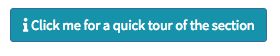

# Data exploration and analysis using the ideal
For each panel, you can select the following button to get help:  
  

## Data setup
We will first create a _dds_ object ("DESeqDataSet object") that will contain all necessary information for further processing.   
 Select the __Data Setup__ panel:    

### Step 1: import data tables
 Import the `counts.final.tsv` and the `design.tsv` files. Upon upload, you should have:  
        

You can take a look at how __ideal__ imported your counts.
      

### Step 2: generate the dds object
From the authors of DESeq2:   
> The object class used by the DESeq2 package to store the read counts and the intermediate estimated quantities during statistical analysis is the DESeqDataSet, which will usually be represented in the code here as an object dds.

Generate the _dds_ object by selecting the _condition_ for the experimental design. This will indicate that we want to compare the levels (_control_ and _drought_) of the _condition_ column from the `design.tsv`.
    

Once this is done, you'll see a short summary of the _DESeqDataSet_ object that you've generated.  Skip the two optional steps and move on to Step 3.

### Step 3: run DESeq2
Finally, we compute a standard differential expression analysis by running the `DESeq` function. If you want to learn more about the theory behind it, have a look at the manual of DESeq2 [here](https://www.bioconductor.org/packages/devel/bioc/vignettes/DESeq2/inst/doc/DESeq2.html#theory).   

Click on `Run DESeq`:  
    

## Counts overview
<- add picture of Counts overview panel ->  
### Data scale
__Data scale in the table__: here you can change the units of the counts. Try different ones:
- Counts (raw)
- Counts (normalized)
- Log10 (pseudocount of 1 added)

__Question:__ what is the unit difference between raw and normalized counts? Any idea why?

### Basic summary
In the __Basic summary__ subsection, you can see a summary of the count data.   
Try to change the __"Threshold on the row sums of the counts"__ value from 0 to some other bigger number.

### Sample correlations
Here you can visualise the correlation between your samples.

## Extract results
<- add picture of Extract Results panel ->

### Select the experimental factor
Since we have only one experimental factor that is quite easy: select the "condition" factor that contains the _drought_ and _control_ levels.

__Question:__ what should you   
Then select the numerator (_drought_) and denominator (control).

### Result table

Explanation of the results:
> The first column, baseMean, is a just the average of the normalized count values, divided by the size factors, taken over all samples in the DESeqDataSet. The remaining four columns refer to a specific contrast, namely the comparison of the trt level over the untrt level for the factor variable dex. We will find out below how to obtain other contrasts.

### Diagnostic plots
- p-value histogram
- stratified p-value histogram
- log2 fold change histogram

## Summary Plots
- MA plot: mean of normalized counts _versus_ log fold change
- Zoom in a section of the MA plot + select a gene to display the boxplot
- Volcano plot: log2 Fold Change _versus_ -log10(pvalue)  
- Heatmap: built from the region you have selected in the MA plot

__Exercise__: in the MA plot, zoom on a region with nonDE genes (black). Look at the heatmap. Redo this with a region with DE genes (red). What can you say about the clustered heatmap?

## Gene of interest
Here you can look for your favorite gene of interest.      
